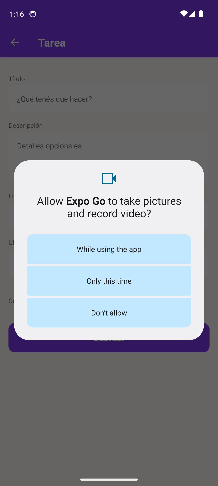
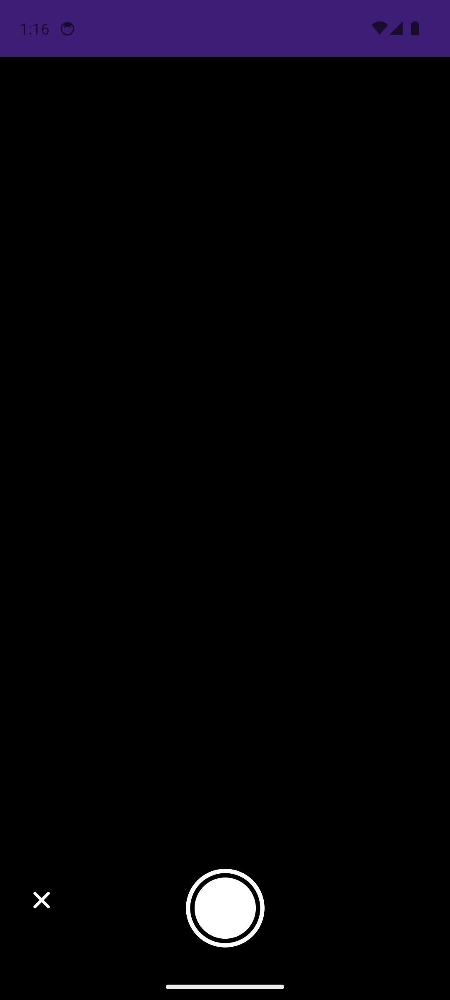
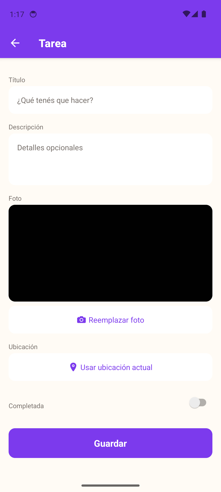
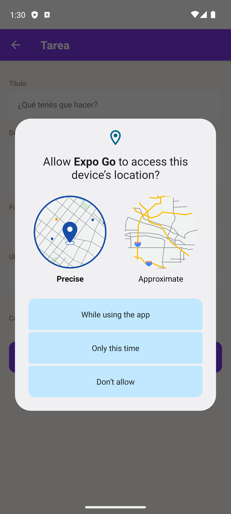
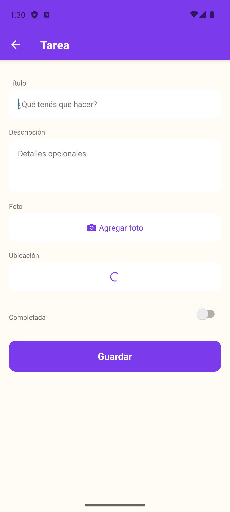

# Informe de pruebas: permisos de cámara y ubicación

Pruebas realizadas sobre emulador Android (Pixel 7, Android 14, API 34, imagen `google_apis_playstore`), app "To Do List" corriendo vía Expo Go (SDK 54).

Flujo probado: pantalla 1 (Mis tareas) → FAB "+" → TaskFormScreen → botones "Agregar foto" / "Usar ubicación actual".

---

## 1. Permiso de cámara

### 1.1 Solicitud lazy del permiso

Al tocar "Agregar foto" por primera vez, Android muestra el diálogo nativo de permiso recién en ese momento (no al abrir la app), tal como especifica `DESIGN.md` (flujo de permisos, solicitud lazy).

### 1.2 Permiso otorgado

Al elegir "While using the app", el permiso se concede y se abre la vista de cámara (`CameraView`) con el botón de captura.

### 1.3 Foto capturada y guardada

Tras tocar el botón de captura, la foto se comprime (`expo-image-manipulator`, máx. 1080px, calidad 70%), se guarda en el filesystem del dispositivo (`expo-file-system`) y el formulario muestra el preview + botón cambia a "Reemplazar foto", confirmando que `photoUri` quedó seteado.

---

## 2. Permiso de ubicación

### 2.1 Solicitud lazy del permiso

Al tocar "Usar ubicación actual" por primera vez, Android muestra el diálogo nativo pidiendo acceso a la ubicación (con opciones Precise/Approximate), también solicitado de forma lazy.

### 2.2 Permiso otorgado

Al elegir "While using the app", el permiso se concede — confirmado además a nivel de sistema operativo (logcat: `PermissionGrantResult ... permission=android.permission.ACCESS_FINE_LOCATION ... result=4`, grant real, no simulado). La app entra en estado de carga (`isFetchingLocation`) mientras espera la coordenada del sistema.

> **Nota:** la resolución final de la coordenada GPS quedó bloqueada por una limitación conocida del backend de ubicación del emulador Android (Fused Location Provider no procesa correctamente los fixes inyectados por consola sin un dispositivo físico o Extended Controls por GUI). El permiso en sí — que es lo que valida este informe — quedó otorgado y confirmado por el sistema operativo. El código de la app (`TaskFormScreen.tsx`, `handleUseLocation`) no arrojó ningún error durante la prueba.

---

## Resumen

| Permiso | Solicitud lazy | Diálogo nativo | Permiso otorgado | Acción posterior |
|---|---|---|---|---|
| Cámara | ✅ | ✅ | ✅ | ✅ Foto capturada y guardada |
| Ubicación | ✅ | ✅ | ✅ (confirmado por SO) | ⚠️ Coordenada bloqueada por emulador (no por la app) |
